# Documentación de Proyecto: Nexus ATS (Next-Gen Recruitment Ecosystem)
FASE DE DISEÑO Y ANÁLISIS

## 1. Resumen Ejecutivo (Product Management)

### 1.1. Descripción del Sistema
**Nexus ATS** es un ecosistema de gestión de talento diseñado bajo una arquitectura de **SaaS Multitenant**. Su objetivo es transformar el reclutamiento tradicional en un proceso inteligente, eliminando silos entre los departamentos de RR.HH. y los líderes de equipo (*Hiring Managers*).

### 1.2. Propuesta de Valor y Ventajas Competitivas
* **IA Híbrida (Copiloto + Autómata):** No es solo un buscador; es un asistente que redacta, puntúa y recomienda acciones.
* **Colaboración en Tiempo Real:** Interfaz diseñada para la toma de decisiones inmediata, reduciendo el "Time-to-Hire".
* **Agnóstico al Ecosistema:** Integración profunda vía API con LinkedIn, Slack, Microsoft Teams y herramientas de calendario.
* **Escalabilidad Adaptativa:** Flujos de trabajo configurables según el tamaño de la empresa (Tiers Startup y Enterprise).

### 1.3. Lean Canvas del Modelo de Negocio
| Bloque | Detalle |
| :--- | :--- |
| **Problema** | Procesos lentos, falta de comunicación Reclutador-Manager, pérdida de candidatos por falta de feedback. |
| **Solución** | Automatización de cribado por IA, Hub de colaboración síncrona, Workflow Engine configurable. |
| **Propuesta de Valor** | "Contrata al mejor talento 3 veces más rápido con IA que entiende tu cultura." |
| **Métricas Clave** | Time-to-hire, Candidate Experience Score (NPS), Eficiencia del Reclutador. |
| **Segmentos** | Startups tecnológicas y Grandes Corporaciones con alto volumen de contratación. |

---

## 2. Análisis de Software y Casos de Uso
**Responsable:** *Senior Software Analyst*

### UC-01: Configuración Inteligente de Vacante (Smart Job Architect)
* **Actor:** Hiring Manager.
* **Descripción:** Creación asistida de la oferta de empleo. La IA analiza el mercado (benchmarking) y sugiere los requerimientos técnicos y el rango salarial.
* **Flujo Principal:** 1. El usuario define el título del rol.
    2. La IA genera una descripción inclusiva y optimizada para SEO.
    3. El sistema valida el presupuesto con el departamento financiero mediante integración.
* **Diagrama de Caso de Uso (Lógica de Proceso)**
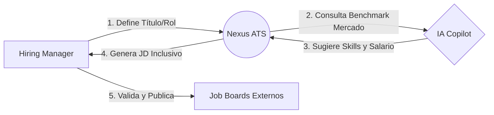
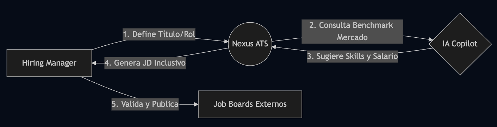

### UC-02: Cribado y Evaluación Automatizada (AI-Powered Screening)
* **Actor:** Candidato / Sistema.
* **Descripción:** Al recibir una aplicación, el motor de IA realiza un análisis semántico del CV (no solo palabras clave) y calcula un **Fit Score**.
* **Flujo Principal:**
    1. El candidato sube su perfil.
    2. El sistema genera un embedding vectorial del CV.
    3. Si el score es > 80%, se dispara automáticamente una invitación a un test técnico.
* **Diagrama de Secuencia Simplificado**
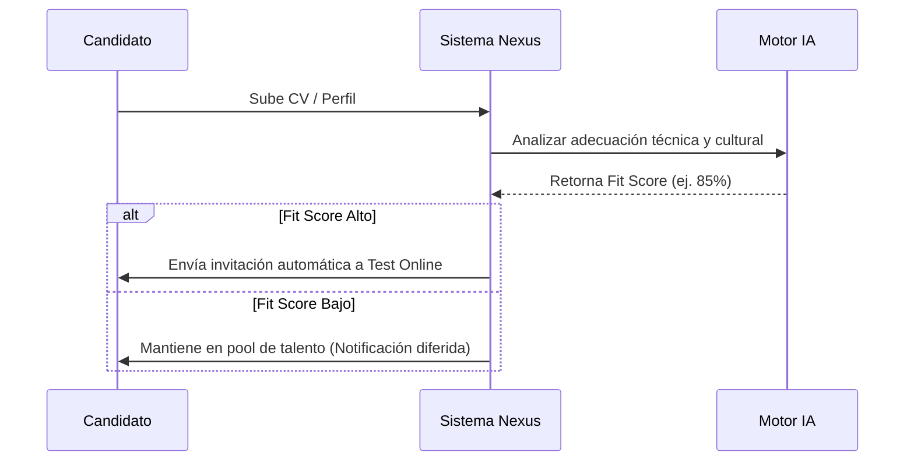
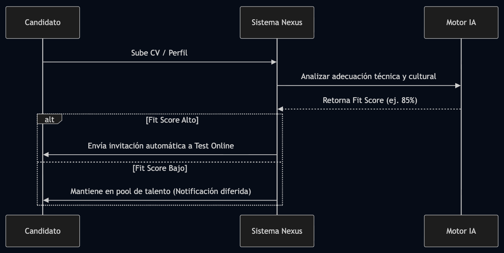

### UC-03: Decisión Colaborativa (Collaborative Review)
* **Actor:** Reclutador y Hiring Manager.
* **Descripción:** Espacio común donde se centraliza el feedback. La IA genera resúmenes ejecutivos de cada candidato finalista.
* **Flujo Principal:**
    1. Revisión de notas y resultados de tests.
    2. Votación síncrona (Scorecards).
    3. Generación automática de la oferta digital para el seleccionado.
* **Diagrama de Actividad**
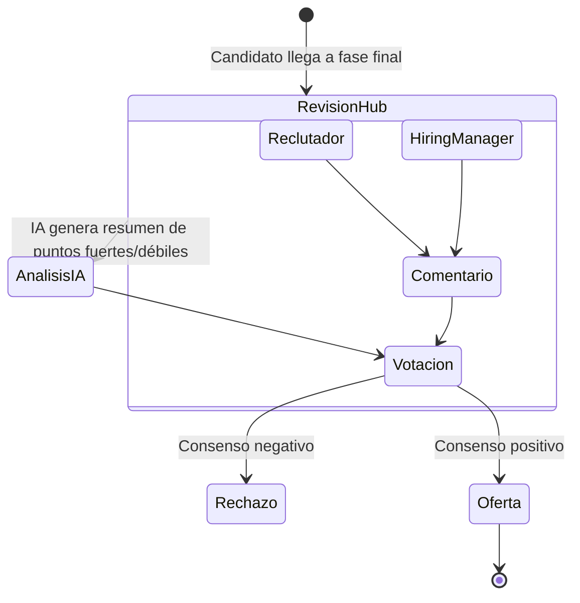
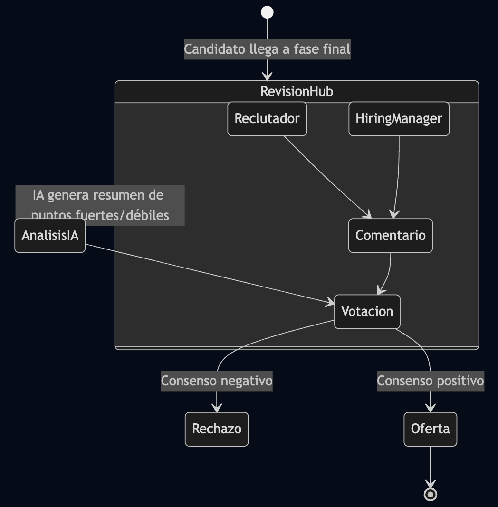

---

## 3. Arquitectura de Datos
**Responsable:** *Software Architect*

### 3.1. Definición de Entidades Principales

#### **A. Company (Tenant)**
Representa al cliente del software. Es la base de la arquitectura *multitenant*.
* **Campos:** `id` (UUID), `name` (String), `industry` (Enum), `tier` (Enum: Startup/Enterprise), `settings` (JSON - para configuraciones de IA y flujo).

#### **B. JobPosition (Vacante)**
Define la necesidad de contratación.
* **Campos:** `id` (UUID), `company_id` (FK), `title` (String), `status` (Enum: Open, Closed, Draft), `jd_text` (Text), `salary_range` (String).

#### **C. Candidate (Candidato)**
La entidad central de la persona que aplica.
* **Campos:** `id` (UUID), `first_name` (String), `last_name` (String), `email` (String/Unique), `resume_url` (String), `linkedin_url` (String).

#### **D. Application (Postulación)**
Relación entre un candidato y una vacante específica.
* **Campos:** `id` (UUID), `candidate_id` (FK), `job_id` (FK), `current_stage` (String), `ai_fit_score` (Float), `status` (Enum: Applied, Interviewing, Rejected, Hired).

#### **E. Interaction/Feedback (Colaboración)**
Notas y evaluaciones de los reclutadores/managers.
* **Campos:** `id` (UUID), `application_id` (FK), `user_id` (FK), `score` (Integer), `comment` (Text).

### 3.2. Diagrama del Modelo de Datos (ERD)

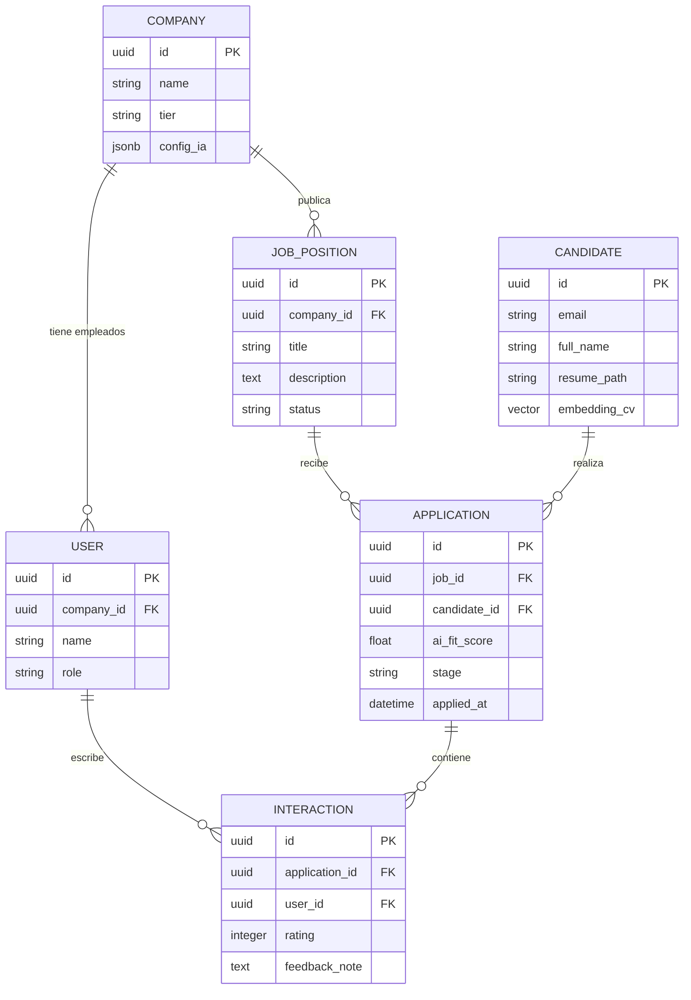
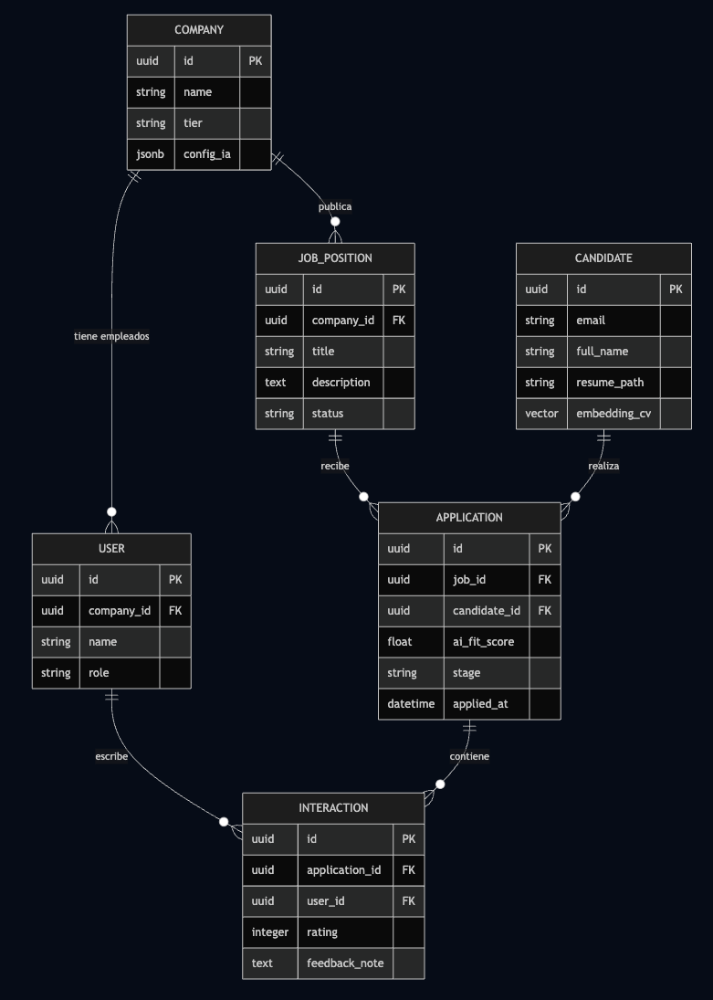

### 3.3. Justificación de la Arquitectura de Datos

1.  **Aislamiento de Datos (Multitenancy):** Todas las entidades principales (`JobPosition`, `User`) cuelgan de `Company`. Esto garantiza que, a nivel de consulta, siempre filtremos por `company_id` para evitar fugas de datos entre clientes.
2.  **Preparación para IA:** En la entidad `CANDIDATE`, he incluido el campo `embedding_cv` de tipo **vector**. Esto es vital para el "ATS del futuro", ya que permite realizar búsquedas por similitud semántica en lugar de solo palabras clave tradicionales.
3.  **Flexibilidad de Flujo:** La tabla `APPLICATION` actúa como una máquina de estados. El campo `stage` permite que cada empresa defina sus propias fases (ej: "Test Técnico", "Entrevista con CEO") sin cambiar el esquema de la base de datos.

---

## 4. Diseño de Sistemas (Alto Nivel)
**Responsable:** *Software Architect*

## 4.1. Diagrama de Arquitectura de Alto Nivel

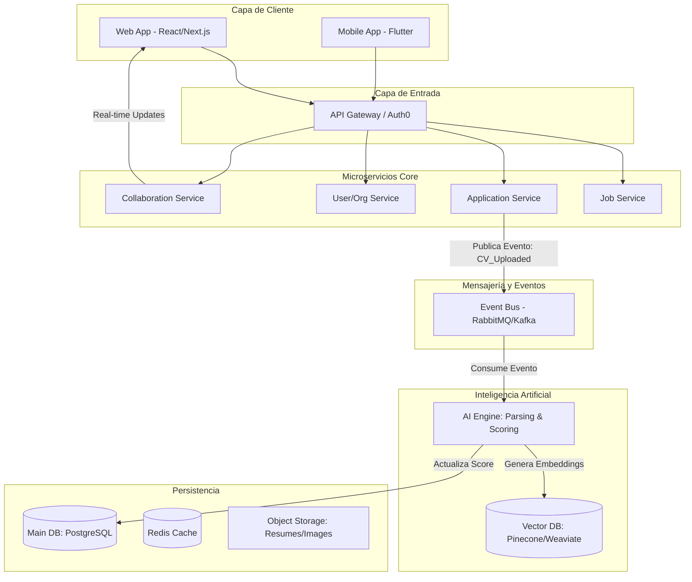
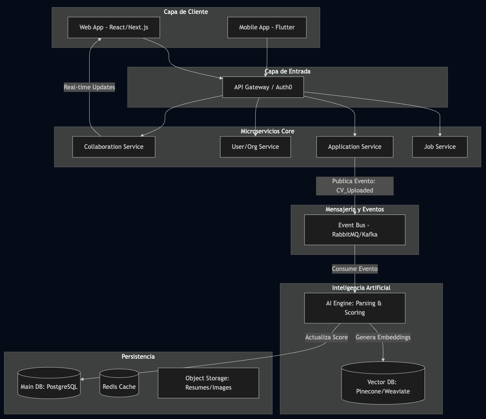

## 4.2. Componentes Clave del Sistema

### A. API Gateway & Auth
Centraliza la seguridad mediante **JWT** y gestiona el **Rate Limiting**. Es fundamental para el modelo de negocio, ya que aquí se valida el `tier` del cliente (Startup vs. Enterprise) para permitir o denegar el acceso a ciertas funcionalidades avanzadas.

### B. Microservicios Core
* **Job Service:** Gestiona el ciclo de vida de las vacantes.
* **Application Service:** Maneja el flujo de los candidatos. Es el componente con más carga.
* **Collaboration Service:** Utiliza **WebSockets** para permitir que el Reclutador y el Manager vean los cambios y comentarios del otro en tiempo real sin refrescar la página.

### C. Motor de IA y Estrategia de Datos (Event-Driven)
Aquí reside la "magia". El análisis de un CV es una tarea pesada que no debe bloquear la interfaz de usuario:
1.  Cuando un candidato sube un CV, el **Application Service** guarda el archivo en **S3** y publica un evento en el **Event Bus**.
2.  El **AI Engine** (consumidor) detecta el evento, procesa el PDF, genera el "Fit Score" y crea un *embedding* vectorial.
3.  El resultado se guarda en la **Vector DB** (para búsquedas semánticas) y se actualiza la base de datos principal, notificando al usuario mediante un push.

### D. Persistencia Políglota
* **PostgreSQL:** Para datos relacionales y transaccionales (pagos, usuarios, estructura organizacional).
* **Vector DB (ej. Pinecone):** Para buscar candidatos por "concepto" (ej: "Busca a alguien que sepa de arquitecturas escalables" aunque el CV no diga esa frase exacta).
* **Redis:** Para caché de sesiones y para el ranking de candidatos más consultados, reduciendo la latencia.

## 4.3. Atributos de Calidad (Trade-offs)
* **Escalabilidad:** Al usar microservicios, si hay una época de alta contratación (ej. Q1), podemos escalar solo el `Application Service` y el `AI Engine` sin afectar al resto.
* **Resiliencia:** Si el motor de IA se cae, los candidatos pueden seguir aplicando; los CVs se encolarán en el Event Bus y se procesarán automáticamente cuando el servicio vuelva a estar en línea.

---

## 5. Diseño Detallado: Application Service (Modelo C4)
**Responsable:** *Software Architect*

Presentaré los tres primeros niveles (Contexto, Contenedores y Componentes) para visualizar cómo el servicio interactúa con la IA y el bus de eventos.

### Nivel 1: Diagrama de Contexto
Define cómo el sistema Nexus ATS interactúa con los usuarios y sistemas externos.

* **Personas:** Candidatos (aplican) y Reclutadores (gestionan).
* **Sistemas Externos:** LinkedIn (perfiles), Servicios de Email (notificaciones) y Job Boards.

### Nivel 2: Diagrama de Contenedores (Foco en Aplicación)
Aquí vemos cómo el **Application Service** es una pieza dentro del ecosistema de microservicios.

* **Web/Mobile App:** Consumen la API.
* **Application Service:** El contenedor que orquesta las postulaciones.
* **Message Broker (Kafka/RabbitMQ):** Desacopla el servicio del motor de IA.
* **Database & S3:** Almacenamiento de metadatos y documentos (CVs).

### Nivel 3: Diagrama de Componentes del Microservicio
Este diagrama detalla las piezas internas del microservicio Application Service y su lógica de negocio.

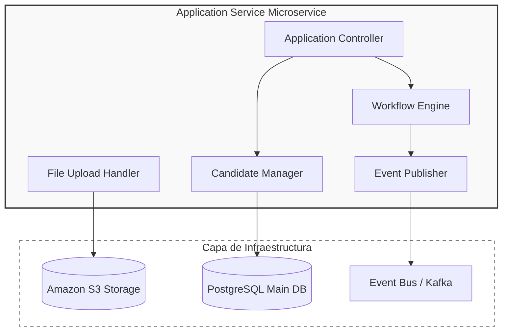
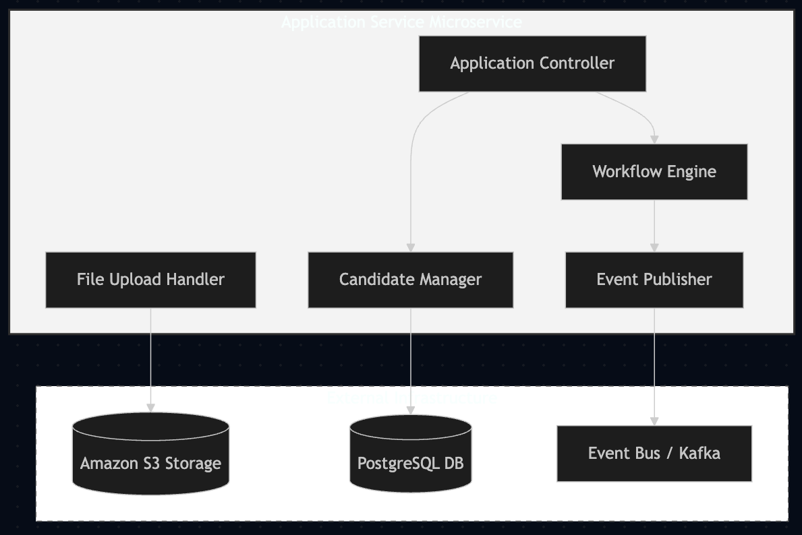

#### Descripción de Componentes Internos:

1.  **Application Controller (API Rest):** Expone los endpoints para que los candidatos suban su información y los reclutadores consulten el estado.
2.  **File Upload Handler:** Se encarga de la lógica de streaming hacia S3. Genera el `file_path` que se persistirá en la base de datos.
3.  **Candidate Manager:** Gestiona el perfil del candidato, la normalización de datos básicos y la persistencia en PostgreSQL.
4.  **Workflow Engine:** Contiene la lógica de estados (Applied -> Screening -> Interview). Es el que decide, basándose en la configuración del cliente, qué paso sigue.
5.  **Event Publisher:** Una vez que un CV es guardado, este componente envía un mensaje al **Event Bus** para que el `AI Engine` (fuera de este servicio) comience el análisis sin bloquear al usuario.

### Atributos Técnicos del Diseño
* **Encapsulamiento:** El servicio de aplicación no sabe *cómo* la IA analiza el CV; solo sabe que debe enviar un evento y esperar una actualización.
* **Escalabilidad Horizontal:** Podemos lanzar múltiples instancias de este contenedor detrás del Load Balancer durante picos de tráfico (ej. campañas de contratación masivas).
* **Seguridad:** Implementa un Middleware de validación de roles para asegurar que un Reclutador de la "Empresa A" no pueda ver aplicaciones de la "Empresa B".

---

## 6. Resumen de Tecnologías Sugeridas
* **Backend:** Node.js (NestJS) para microservicios core; Python para IA.
* **Frontend:** React con Next.js para el dashboard administrativo.
* **IA:** Modelos LLM vía API (OpenAI/Anthropic) + embeddings locales.
* **DevOps:** Docker, Kubernetes y Terraform para Infrastructure as Code (IaC).
